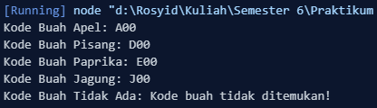
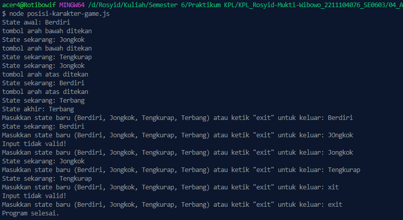

<h2>Nama : Rosyid Mukti Wibowo</h2>
<h2>NIM: 2211104076</h2>
<h2>Kelas : SE-06-03</h2>

<h3>Jurnal Modul 4</h3>

### Jurnal Kode Buah
- Source Code 
```
class KodeBuah {
    constructor() {
        this.kodeBuahTable = [
            { namaBuah: "Apel", kodeBuah: "A00" },
            { namaBuah: "Aprikot", kodeBuah: "B00" },
            { namaBuah: "Alpukat", kodeBuah: "C00" },
            { namaBuah: "Pisang", kodeBuah: "D00" },
            { namaBuah: "Paprika", kodeBuah: "E00" },
            { namaBuah: "Blackberry", kodeBuah: "F00" },
            { namaBuah: "Ceri", kodeBuah: "H00" },
            { namaBuah: "Kelapa", kodeBuah: "I00" },
            { namaBuah: "Jagung", kodeBuah: "J00" },
            { namaBuah: "Kurma", kodeBuah: "K00" },
            { namaBuah: "Durian", kodeBuah: "L00" },
            { namaBuah: "Anggur", kodeBuah: "M00" },
            { namaBuah: "Melon", kodeBuah: "N00" },
            { namaBuah: "Semangka", kodeBuah: "O00" },
        ];
    }

    getKodeBuah(namaBuah) {
        const result = this.kodeBuahTable.find(
            (item) => item.namaBuah.toLowerCase() === namaBuah.toLowerCase()
        );
        if (result) {
            return result.kodeBuah;
        } else {
            return "Kode buah tidak ditemukan!";
        }
    }
}

// Main
const kodeBuah = new KodeBuah();

// Contoh pemanggilan method getKodeBuah
console.log("Kode Buah Apel: " + kodeBuah.getKodeBuah("Apel"));
console.log("Kode Buah Pisang: " + kodeBuah.getKodeBuah("Pisang"));
console.log("Kode Buah Paprika: " + kodeBuah.getKodeBuah("Paprika"));
console.log("Kode Buah Jagung: " + kodeBuah.getKodeBuah("Jagung"));
console.log("Kode Buah Tidak Ada: " + kodeBuah.getKodeBuah("Tidak Ada")); 
```

- Berikut ini output code tersebut: <br>


- Berikut ini penjelasannya : Kode di atas merupakan implementasi kelas **KodeBuah** dalam JavaScript yang berfungsi untuk menyimpan dan mencari kode dari berbagai nama buah. Di dalam konstruktor kelas, terdapat properti `kodeBuahTable` berupa array objek yang berisi pasangan **nama buah dan kode buah**. Kelas ini memiliki method `getKodeBuah(namaBuah)` yang digunakan untuk mencari kode buah berdasarkan nama buah yang diinputkan. Proses pencarian menggunakan method `find()` yang akan mencocokkan nama buah (dengan perbandingan huruf kecil) dan mengembalikan kode buah yang sesuai jika ditemukan, atau menampilkan pesan "Kode buah tidak ditemukan!" jika nama buah tidak ada dalam daftar. Pada bagian akhir, terdapat contoh pemanggilan method `getKodeBuah` untuk beberapa nama buah, dan hasilnya ditampilkan ke console.

<br>

### Jurnal Posisi Karakter Game
- Source Code 
```
const readline = require('readline').createInterface({
    input: process.stdin,
    output: process.stdout
});

class PosisiKarakterGame {
    constructor() {
        this.state = "Berdiri";
    }

    ubahState(stateBaru) {
        let nim = 2211104076;
        if (nim % 3 === 1) {
            if (stateBaru === "Berdiri") console.log("posisi standby");
            if (stateBaru === "Tengkurap") console.log("posisi istirahat");
        }
        if (nim % 3 === 2) {
            if (this.state === "Terbang" && stateBaru === "Jongkok") console.log("posisi landing");
            if (this.state === "Berdiri" && stateBaru === "Terbang") console.log("posisi take off");
        }
        this.state = stateBaru;
        console.log(`State sekarang: ${this.state}`);
    }

    tekanTombolS() {
        let nim = 2211104076;
        if (nim % 3 === 0) console.log("tombol arah bawah ditekan");
        if (this.state === "Berdiri") this.ubahState("Jongkok");
        else if (this.state === "Jongkok") this.ubahState("Tengkurap");
    }

    tekanTombolW() {
        let nim = 2211104076;
        if (nim % 3 === 0) console.log("tombol arah atas ditekan");
        if (this.state === "Jongkok") this.ubahState("Berdiri");
        else if (this.state === "Berdiri") this.ubahState("Terbang");
    }

    tekanTombolX() {
        if (this.state === "Tengkurap") this.ubahState("Jongkok");
    }
}

const karakter = new PosisiKarakterGame();
console.log(`State awal: ${karakter.state}`);

karakter.tekanTombolS();
karakter.tekanTombolS();
karakter.tekanTombolX();
karakter.tekanTombolW();
karakter.tekanTombolW();

console.log(`State akhir: ${karakter.state}`);

function tanyaUser() {
    readline.question('Masukkan state baru (Berdiri, Jongkok, Tengkurap, Terbang) atau ketik "exit" untuk keluar: ', (input) => {
        if (input === "exit") {
            console.log("Program selesai.");
            readline.close();
            return;
        }

        if (["Berdiri", "Jongkok", "Tengkurap", "Terbang"].includes(input)) {
            karakter.ubahState(input);
        } else {
            console.log("Input tidak valid!");
        }
        tanyaUser();
    });
}

tanyaUser();
```

- Berikut ini output code tersebut: <br>


- Berikut ini penjelasannya : Kode tersebut merupakan implementasi **State-Based Construction** pada class **PosisiKarakterGame**, yang berfungsi untuk mengatur posisi karakter game berdasarkan input dari user maupun otomatis. Kelas ini memiliki state awal **"Berdiri"** dan beberapa metode seperti `tekanTombolS()`, `tekanTombolW()`, dan `tekanTombolX()` untuk mengubah state berdasarkan diagram transisi, serta `ubahState(stateBaru)` untuk memproses perubahan state secara langsung. Terdapat logika tambahan berdasarkan NIM (2211104076) dengan aturan khusus sesuai hasil modulus NIM % 3. Setelah melakukan simulasi transisi otomatis, program dilanjutkan dengan **input interaktif dari user** menggunakan `readline`, yang memungkinkan user memasukkan state secara manual dan melihat perubahan state secara real-time, sampai user mengetik **"exit"** untuk menghentikan program.