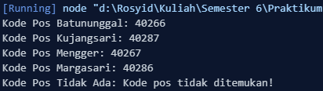
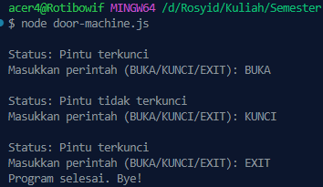

<h2>Nama : Rosyid Mukti Wibowo</h2>
<h2>NIM: 2211104076</h2>
<h2>Kelas : SE-06-03</h2>

<h3>TP Modul 4</h3>

### TP Kode Pos
- Source Code 
```
class KodePos {
    constructor() {
        this.kodePosTable = [
            { kelurahan: "Batununggal", kodePos: "40266" },
            { kelurahan: "Kujangsari", kodePos: "40287" },
            { kelurahan: "Mengger", kodePos: "40267" },
            { kelurahan: "Wates", kodePos: "40256" },
            { kelurahan: "Cijaura", kodePos: "40287" },
            { kelurahan: "Jatisari", kodePos: "40286" },
            { kelurahan: "Margasari", kodePos: "40286" },
            { kelurahan: "Sekejati", kodePos: "40286" },
            { kelurahan: "Kebonwaru", kodePos: "40272" },
            { kelurahan: "Maleer", kodePos: "40274" },
            { kelurahan: "Samoja", kodePos: "40273" }
        ];
    }

    
    getKodePos(kelurahan) {
        const result = this.kodePosTable.find(
            (item) => item.kelurahan.toLowerCase() === kelurahan.toLowerCase()
        );
        if (result) {
            return result.kodePos;
        } else {
            return "Kode pos tidak ditemukan!";
        }
    }
}


const kodePos = new KodePos(); 

console.log("Kode Pos Batununggal: " + kodePos.getKodePos("Batununggal"));
console.log("Kode Pos Kujangsari: " + kodePos.getKodePos("Kujangsari"));
console.log("Kode Pos Mengger: " + kodePos.getKodePos("Mengger"));
console.log("Kode Pos Margasari: " + kodePos.getKodePos("Margasari"));
console.log("Kode Pos Tidak Ada: " + kodePos.getKodePos("Tidak Ada")); 
```

- Berikut ini output code tersebut: <br>


- Berikut ini penjelasannya : Kode tersebut merupakan implementasi class **KodePos** dalam JavaScript yang berisi daftar kelurahan beserta kode posnya dalam bentuk array of objects. Class ini memiliki method **getKodePos(kelurahan)** untuk mencari dan mengembalikan kode pos berdasarkan nama kelurahan yang dicari, dengan mencocokkan data menggunakan fungsi **find()**. Jika kelurahan ditemukan, akan dikembalikan kode posnya, dan jika tidak ditemukan, akan muncul pesan "Kode pos tidak ditemukan!". Pada bagian akhir, class ini digunakan untuk menampilkan beberapa contoh pencarian kode pos melalui **console.log()**.

<br>

### TP Door Machine
- Source Code 
```
const readline = require('readline');

const rl = readline.createInterface({
    input: process.stdin,
    output: process.stdout
});


const State = {
    TERKUNCI: 'TERKUNCI',
    TERBUKA: 'TERBUKA',
    EXIT: 'EXIT'
};

let state = State.TERKUNCI; 

const screenNames = {
    [State.TERKUNCI]: 'Pintu terkunci',
    [State.TERBUKA]: 'Pintu tidak terkunci',
    [State.EXIT]: 'Keluar'
};

function displayScreen() {
    console.log(`\nStatus: ${screenNames[state]}`);
    rl.question('Masukkan perintah (BUKA/KUNCI/EXIT): ', (command) => {
        handleCommand(command.toUpperCase());
    });
}

function handleCommand(command) {
    switch (state) {
        case State.TERKUNCI:
            if (command === 'BUKA') {
                state = State.TERBUKA;
            } else if (command === 'EXIT') {
                state = State.EXIT;
            } else {
                console.log('Perintah tidak valid saat pintu terkunci!');
            }
            break;

        case State.TERBUKA:
            if (command === 'KUNCI') {
                state = State.TERKUNCI;
            } else if (command === 'EXIT') {
                state = State.EXIT;
            } else {
                console.log('Perintah tidak valid saat pintu terbuka!');
            }
            break;
    }

    if (state !== State.EXIT) {
        displayScreen(); 
    } else {
        console.log('Program selesai. Bye!');
        rl.close(); 
    }
}

displayScreen(); 
```

- Berikut ini output code tersebut: <br>


- Berikut ini penjelasannya : Kode tersebut adalah program simulasi **state-based construction** untuk pintu menggunakan JavaScript. Program ini memiliki dua state utama, yaitu **TERKUNCI** dan **TERBUKA**, serta state **EXIT** untuk keluar dari program. Awalnya, state pintu adalah "TERKUNCI", lalu pengguna diminta memasukkan perintah lewat **readline**. Jika perintah **BUKA** dimasukkan saat pintu terkunci, state berubah menjadi **TERBUKA**, dan jika perintah **KUNCI** dimasukkan saat pintu terbuka, state kembali menjadi **TERKUNCI**. Selain itu, perintah **EXIT** dapat digunakan kapan saja untuk menghentikan program. Program ini juga memvalidasi perintah yang sesuai dengan state saat ini, serta menampilkan status pintu setiap kali terjadi perubahan state atau saat perintah tidak valid.