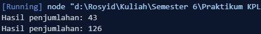
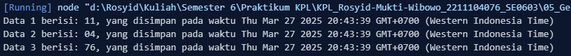

<h2>Nama : Rosyid Mukti Wibowo</h2>
<h2>NIM: 2211104076</h2>
<h2>Kelas : SE-06-03</h2>

<h3>Jurnal Modul 5</h3>

### Jurnal Kode Buah
- Source Code 
```
class Penjumlahan {
    JumlahTigaAngka(a, b, c) {
      let numA = parseFloat(a);
      let numB = parseFloat(b);
      let numC = parseFloat(c);
      
      // Lakukan penjumlahan
      const total = numA + numB + numC;
      console.log(`Hasil penjumlahan: ${total}`);
    }
}

const penjumlahan = new Penjumlahan();
penjumlahan.JumlahTigaAngka("22", "11", "10"); // NIM saya 2211104076
penjumlahan.JumlahTigaAngka("10", "40", "76"); // NIM saya 2211104076 
```

- Berikut ini output code tersebut: <br>


- Kode di atas mendefinisikan kelas `Penjumlahan` yang memiliki metode `JumlahTigaAngka(a, b, c)`, yang menerima tiga parameter, mengonversinya menjadi angka menggunakan `parseFloat()`, lalu menjumlahkannya dan mencetak hasilnya ke konsol. Objek `penjumlahan` dibuat dari kelas tersebut, kemudian metode `JumlahTigaAngka()` dipanggil dua kali dengan tiga angka sebagai argumen, yang berasal dari dua digit NIM `"2211104076"` yaitu `"22"`, `"11"`, dan `"10"`, serta kombinasi lain `"10"`, `"40"`, dan `"76"`, untuk menghitung hasil penjumlahan masing-masing set angka tersebut.

<br>

### Jurnal Posisi Karakter Game
- Source Code 
```
class SimpleDatabase {
    constructor() {
        this.storedData = []; 
        this.inputDates = []; 
    }

    AddNewData(data) {
        this.storedData.push(data); 
        this.inputDates.push(new Date()); 
    }
    
    PrintAllData() {
        this.storedData.forEach((data, index) => {
            console.log(`Data ${index + 1} berisi: ${data}, yang disimpan pada waktu ${this.inputDates[index]}`);
        });
    }
}

const database = new SimpleDatabase();
database.AddNewData("11");
database.AddNewData("04");
database.AddNewData("76");

database.PrintAllData();
```

- Berikut ini output code tersebut: <br>


- Kode di atas mendefinisikan kelas SimpleDatabase yang berfungsi sebagai penyimpanan data sederhana dengan dua properti: storedData (untuk menyimpan data) dan inputDates (untuk mencatat waktu penyimpanan setiap data). Metode AddNewData(data) menambahkan data ke dalam storedData dan mencatat waktu penyimpanannya ke dalam inputDates menggunakan new Date(). Metode PrintAllData() menampilkan semua data yang telah disimpan beserta waktu penyimpanannya. Objek database dibuat dari kelas ini, lalu metode AddNewData() dipanggil tiga kali untuk menyimpan nilai "11", "04", dan "76" (dua digit dari NIM 2211104076), kemudian PrintAllData() dipanggil untuk mencetak semua data beserta waktu penyimpanannya ke konsol.