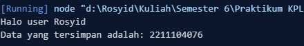

<h2>Nama : Rosyid Mukti Wibowo</h2>
<h2>NIM: 2211104076</h2>
<h2>Kelas : SE-06-03</h2>

<h3>TP Modul 5</h3>

### TP Kode Pos
- Source Code HaloGeneric
```
class HaloGeneric {
    SapaUser(user) {
        console.log(`Halo user ${user}`);
    }
}

const hai = new HaloGeneric();
hai.SapaUser("Rosyid"); 
```

- Source Code DaraGeneric
```
class DataGeneric {
    constructor(data) {
        this.data = data; 
    }

    PrintData() {
        console.log(`Data yang tersimpan adalah: ${this.data}`);
    }
}

const dataNIM = new DataGeneric("2211104076"); 
dataNIM.PrintData();
```

- Berikut ini output code tersebut: <br>


- Kode di atas mendefinisikan dua kelas dalam JavaScript. Kelas HaloGeneric memiliki metode SapaUser(user), yang menerima parameter user dan mencetak pesan sapaan ke konsol, kemudian dibuat objek hai untuk memanggil metode tersebut dengan nama "Rosyid". Kelas DataGeneric menggunakan konstruktor untuk menyimpan data dalam properti data, serta memiliki metode PrintData(), yang mencetak data yang tersimpan dalam format "Data yang tersimpan adalah: ...". Objek dataNIM dibuat dengan data "2211104076" (NIM), dan metode PrintData() dipanggil untuk mencetaknya ke konsol.
