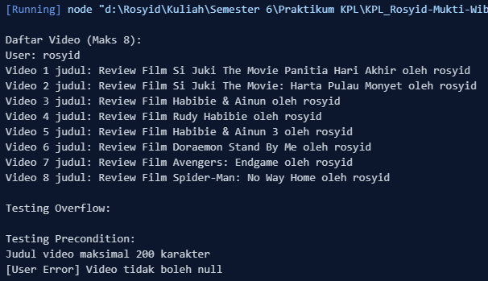

<h2>Nama : Rosyid Mukti Wibowo</h2>
<h2>NIM: 2211104076</h2>
<h2>Kelas : SE-06-03</h2>

<h3>Jurnal Modul 6</h3>

### Jurnal Kode SayaTubeVideo
- Source Code 
```
class SayaTubeVideo {
    constructor(title) {
      // Precondition: Judul video maks 200 karakter dan tidak null
      if (title === null) throw new Error("Judul video tidak boleh null");
      if (title.length > 200) throw new Error("Judul video maksimal 200 karakter");
      
      this.id = this.#generateRandomId();
      this.title = title;
      this.playCount = 0;
    }
  
    #generateRandomId() {
      return Math.floor(10000 + Math.random() * 90000);
    }
  
    increasePlayCount(amount) {
      try {
        // Precondition: Validasi input play count
        if (amount < 0) throw new Error("Play count tidak boleh negatif");
        if (amount > 25000000) throw new Error("Maksimal penambahan 25.000.000 per panggilan");
        
        // Exception handling untuk overflow
        if (this.playCount + amount > Number.MAX_SAFE_INTEGER) {
          throw new Error("Overflow play count");
        }
        
        this.playCount += amount;
      } catch (error) {
        console.error(`[Video Error] ${error.message}`);
      }
    }
  
    printVideoDetails() {
      console.log(`Video Details:
  ID: ${this.id}
  Title: ${this.title}
  Play Count: ${this.playCount.toLocaleString()}\n`);
    }
  }
  
  class SayaTubeUser {
    constructor(username) {
      // Precondition: Validasi username
      if (username === null) throw new Error("Username tidak boleh null");
      if (username.length > 100) throw new Error("Username maksimal 100 karakter");
      
      this.id = this.#generateRandomId();
      this.username = username;
      this.uploadedVideos = [];
    }
  
    #generateRandomId() {
      return Math.floor(10000 + Math.random() * 90000);
    }
  
    addVideo(video) {
      try {
        // Precondition: Validasi video
        if (video === null) throw new Error("Video tidak boleh null");
        if (!(video instanceof SayaTubeVideo)) throw new Error("Tipe video tidak valid");
        if (video.playCount >= Number.MAX_SAFE_INTEGER) {
          throw new Error("Play count video mencapai batas maksimal");
        }
        
        // Postcondition: Maksimal 8 video yang di-print
        if (this.uploadedVideos.length >= 10) {
          throw new Error("Maksimal 10 video per user");
        }
        
        this.uploadedVideos.push(video);
      } catch (error) {
        console.error(`[User Error] ${error.message}`);
      }
    }
  
    getTotalVideoPlayCount() {
      return this.uploadedVideos.reduce(
        (total, video) => total + video.playCount, 0
      );
    }
  
    printAllVideoPlaycount() {
      console.log(`User: ${this.username}`);
      // Postcondition: Cetak maksimal 8 video
      this.uploadedVideos.slice(0, 8).forEach((video, index) => {
        console.log(`Video ${index + 1} judul: ${video.title}`);
      });
    }
  }
  
  // Implementasi dan Testing
  const namaPraktikan = "rosyid";
  const films = [
    "Si Juki The Movie Panitia Hari Akhir", 
    "Si Juki The Movie: Harta Pulau Monyet",
    "Habibie & Ainun",
    "Rudy Habibie",
    "Habibie & Ainun 3",
    "Doraemon Stand By Me",
    "Avengers: Endgame",
    "Spider-Man: No Way Home",
    "The Batman",
    "Minions 2"
  ];
  
  try {
    // Membuat user
    const user = new SayaTubeUser(namaPraktikan);
    
    // Menambahkan 10 video
    films.forEach((film, index) => {
      const title = `Review Film ${film} oleh ${namaPraktikan}`;
      const video = new SayaTubeVideo(title);
      
      // Tambahkan play count yang valid
      video.increasePlayCount(Math.floor(Math.random() * 25000000));
      user.addVideo(video);
    });
  
    // Test print maksimal 8 video
    console.log("\nDaftar Video (Maks 8):");
    user.printAllVideoPlaycount();
  
    // Testing overflow exception
    console.log("\nTesting Overflow:");
    const testVideo = new SayaTubeVideo("Stress Test");
    try {
      for(let i = 0; i < 100; i++) {
        testVideo.increasePlayCount(25000000);
      }
    } catch (e) {
      console.log(e.message);
    }
  
    // Testing invalid cases
    console.log("\nTesting Precondition:");
    
    // Test judul terlalu panjang
    try {
      const invalidVideo = new SayaTubeVideo("a".repeat(201));
    } catch (e) {
      console.log(e.message);
    }
    
    // Test tambah video null
    try {
      user.addVideo(null);
    } catch (e) {
      console.log(e.message);
    }
  
  } catch (error) {
    console.error(`[System Error] ${error.message}`);
  }
```

- Berikut ini output code tersebut: <br>


- Kode ini adalah implementasi JavaScript untuk mensimulasikan platform berbagi video sederhana. Kelas `SayaTubeVideo` merepresentasikan video dengan atribut `id`, `title`, dan `playCount`, serta memiliki metode untuk meningkatkan jumlah pemutaran dengan batas maksimum per pemanggilan dan mencegah overflow. Kelas `SayaTubeUser` merepresentasikan pengguna yang dapat mengunggah hingga 10 video, dengan metode untuk menambahkan video, menghitung total jumlah pemutaran, dan mencetak daftar video (maksimal 8 video ditampilkan). Setiap operasi memiliki validasi, seperti batas panjang judul, jumlah video, dan pengecekan nilai null. Di bagian implementasi, dibuat objek `SayaTubeUser` dengan 10 video ulasan film, diuji dengan penambahan play count secara acak, serta dilakukan pengujian terhadap kasus ekstrem seperti overflow dan input tidak valid.