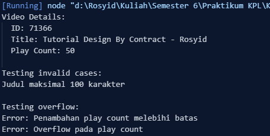

<h2>Nama : Rosyid Mukti Wibowo</h2>
<h2>NIM: 2211104076</h2>
<h2>Kelas : SE-06-03</h2>

<h3>TP Modul 6</h3>

### TP Kode Pos
- Source Code HaloGeneric
```
class SayaTubeVideo {
    constructor(title) {
      // Design by Contract: Validasi judul
      if (title === null) throw new Error("Judul tidak boleh null");
      if (title.length > 100) throw new Error("Judul maksimal 100 karakter");
      
      this.id = this.#generateRandomId();
      this.title = title;
      this.playCount = 0;
    }
  
    // Method untuk generate ID 5 digit
    #generateRandomId() {
      return Math.floor(10000 + Math.random() * 90000);
    }
  
    increasePlayCount(amount) {
      try {
        // Design by Contract: Validasi input
        if (amount > 10000000) throw new Error("Penambahan play count melebihi batas");
        
        // Cek overflow integer
        if (this.playCount + amount > Number.MAX_SAFE_INTEGER) {
          throw new Error("Overflow pada play count");
        }
        
        this.playCount += amount;
      } catch (error) {
        console.error(`Error: ${error.message}`);
      }
    }
  
    printVideoDetails() {
      console.log(
        `Video Details:
  ID: ${this.id}
  Title: ${this.title}
  Play Count: ${this.playCount}`
      );
    }
  }
  
  // Testing implementasi
  try {
    // Membuat video dengan nama praktikan
    const video = new SayaTubeVideo("Tutorial Design By Contract - Rosyid");
    
    // Test case valid
    video.increasePlayCount(50);
    video.printVideoDetails();
    
    // Test case invalid
    console.log("\nTesting invalid cases:");
    
    // Test judul terlalu panjang
    try {
      const longTitle = "a".repeat(101);
      const invalidVideo = new SayaTubeVideo(longTitle);
    } catch (e) {
      console.log(e.message);
    }
    
    // Test penambahan berlebihan
    video.increasePlayCount(10000001);
    
    // Test overflow (dipercepat dengan loop)
    console.log("\nTesting overflow:");
    let tempCount = video.playCount;
    try {
      while(true) {
        video.increasePlayCount(10000000);
        if(tempCount === video.playCount) break;
        tempCount = video.playCount;
      }
    } catch (e) {
      console.log(e.message);
    }
    
  } catch (error) {
    console.error(`Error: ${error.message}`);
  }
```

- Berikut ini output code tersebut: <br>


- Kode ini adalah implementasi JavaScript dari kelas `SayaTubeVideo`, yang merepresentasikan video dengan atribut `id`, `title`, dan `playCount`, serta menerapkan konsep *Design by Contract* untuk memastikan validitas data. Judul video dibatasi maksimal 100 karakter dan tidak boleh `null`, sedangkan *play count* memiliki batas maksimum penambahan 10.000.000 per pemanggilan untuk mencegah overflow. ID video dihasilkan secara acak dalam rentang lima digit. Metode `increasePlayCount(amount)` menangani validasi input dan pengecekan overflow, sementara `printVideoDetails()` menampilkan informasi video. Dalam bagian pengujian, kode membuat objek video dengan nama praktikan, melakukan penambahan *play count*, serta menguji berbagai kasus tidak valid seperti judul terlalu panjang, penambahan *play count* berlebihan, dan pengujian overflow menggunakan loop. Jika terjadi kesalahan, program menangkapnya dan menampilkan pesan error di konsol.
