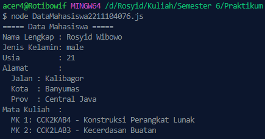
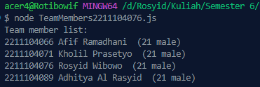
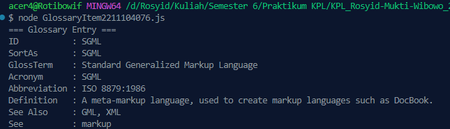

<h2>Nama : Rosyid Mukti Wibowo</h2>
<h2>NIM: 2211104076</h2>
<h2>Kelas : SE-06-03</h2>

<h3>Jurnal Modul 7</h3>

### Jurnal Kode DataMahasiswa
- Source Code 
```
const fs = require('fs');

class DataMahasiswa2211104076 {
    constructor() {
        this.data = null;
    }

    ReadJSON() {
        try {
            // Membaca file JSON
            const rawData = fs.readFileSync('./jurnal7_1_2211104076.json');

            // Parsing data JSON menjadi object
            this.data = JSON.parse(rawData);

            // Menampilkan semua data dengan format bebas tapi lengkap
            console.log("===== Data Mahasiswa =====");
            console.log(`Nama Lengkap : ${this.data.firstName} ${this.data.lastName}`);
            console.log(`Jenis Kelamin: ${this.data.gender}`);
            console.log(`Usia         : ${this.data.age}`);
            console.log("Alamat       :");
            console.log(`  Jalan : ${this.data.address.streetAddress}`);
            console.log(`  Kota  : ${this.data.address.city}`);
            console.log(`  Prov  : ${this.data.address.state}`);
            console.log("Mata Kuliah  :");
            this.data.courses.forEach((course, index) => {
                console.log(`  MK ${index + 1}: ${course.code} - ${course.name}`);
            });

            return this.data;
        } catch (error) {
            console.error("Terjadi kesalahan saat membaca file JSON:", error.message);
            return null;
        }
    }
}

// Contoh penggunaan
const dataMhs = new DataMahasiswa2211104076();
dataMhs.ReadJSON();

module.exports = DataMahasiswa2211104076;
```

- Source Code jurnal7_1_2211104076.json
```
{
    "nama": {
        "depan": "Rosyid",
        "belakang": "Wibowo"
    },
    "nim": 2211104076,
    "fakultas": "informatika"
}
```

- Berikut ini output code tersebut: <br>


- File DataMahasiswa2211104076.js adalah sebuah program Node.js yang digunakan untuk membaca dan menampilkan data lengkap seorang mahasiswa dari file JSON bernama jurnal7_1_2211104076.json. Program ini menggunakan modul fs untuk membaca file secara sinkron, kemudian mengubah isi file menjadi objek JavaScript menggunakan JSON.parse(). Data yang dibaca mencakup nama depan dan belakang, jenis kelamin, usia, alamat lengkap (jalan, kota, provinsi), serta daftar mata kuliah yang diambil, masing-masing dengan kode dan nama. Informasi tersebut kemudian ditampilkan ke konsol dengan format yang rapi dan informatif. Jika terjadi kesalahan saat membaca atau memproses file JSON, maka akan ditampilkan pesan kesalahan. JSON yang dibaca berisi struktur objek mahasiswa secara lengkap, termasuk nested object untuk alamat dan array untuk mata kuliah.

<br>

### Jurnal Team Members
- Source Code 
```
const fs = require('fs');

class TeamMembers2211104076 {
    constructor() {
        this.data = null;
    }

    ReadJSON() {
        try {
            // Membaca file JSON
            const rawData = fs.readFileSync('./jurnal7_2_2211104076.json');

            // Parsing data menjadi object JavaScript
            this.data = JSON.parse(rawData);

            // Menampilkan hasil deserialisasi sesuai format
            console.log("Team member list:");
            this.data.members.forEach(member => {
                console.log(`${member.nim} ${member.firstName} ${member.lastName}  (${member.age} ${member.gender})`);
            });

            return this.data;
        } catch (error) {
            console.error("Terjadi kesalahan saat membaca file JSON:", error.message);
            return null;
        }
    }
}

// Contoh penggunaan
const team = new TeamMembers2211104076();
team.ReadJSON();

module.exports = TeamMembers2211104076;

```

- Source Code jurnal7_2_2211104076.json
```
{
  "members" : [
    {
       "firstName": "Afif",
       "lastName": "Ramadhani",
       "gender": "male",
       "age": 21,
       "nim": "2211104066"
    },
    {
       "firstName": "Kholil",
       "lastName": "Prasetyo",
       "gender": "male",
       "age": 21,
       "nim": "2211104071"
    },
    {
       "firstName": "Rosyid",
       "lastName": "Wibowo",
       "gender": "male",
       "age": 21,
       "nim": "2211104076"
    },
    {
      "firstName": "Adhitya",
      "lastName": "Al Rasyid",
      "gender": "male",
      "age": 21,
      "nim": "2211104089"
   }
  ]
}
```

- Berikut ini output code tersebut: <br>


- File TeamMembers2211104076.js adalah program Node.js yang berfungsi untuk membaca dan menampilkan daftar anggota tim dari file JSON jurnal7_2_2211104076.json. Di dalamnya terdapat kelas TeamMembers2211104076 dengan metode ReadJSON() yang menggunakan modul fs untuk membaca file secara sinkron, lalu mem-parsing isi file menjadi objek JavaScript menggunakan JSON.parse(). Data JSON memuat array members yang berisi informasi setiap anggota tim, seperti NIM, nama depan dan belakang, jenis kelamin, serta usia. Program ini mencetak setiap anggota dengan format "nim nama_lengkap (usia gender)" ke konsol. Jika terjadi kesalahan saat membaca atau memproses data, maka pesan error akan ditampilkan. JSON yang digunakan mencerminkan struktur data tim secara terorganisir dan mudah dibaca.

### Jurnal Glossary Item
- Source Code 
```
const fs = require('fs');

class GlossaryItem2211104076 {
    constructor() {
        this.data = null;
    }

    ReadJSON() {
        try {
            // Membaca dan parsing file JSON
            const rawData = fs.readFileSync('./jurnal7_3_2211104076.json');
            this.data = JSON.parse(rawData);

            // Mengambil bagian GlossEntry
            const entry = this.data.glossary.GlossDiv.GlossList.GlossEntry;

            // Menampilkan informasi GlossEntry dengan format bebas
            console.log("=== Glossary Entry ===");
            console.log(`ID           : ${entry.ID}`);
            console.log(`SortAs       : ${entry.SortAs}`);
            console.log(`GlossTerm    : ${entry.GlossTerm}`);
            console.log(`Acronym      : ${entry.Acronym}`);
            console.log(`Abbreviation : ${entry.Abbrev}`);
            console.log(`Definition   : ${entry.GlossDef.para}`);
            console.log(`See Also     : ${entry.GlossDef.GlossSeeAlso.join(', ')}`);
            console.log(`See          : ${entry.GlossSee}`);

            return entry;
        } catch (error) {
            console.error("Terjadi kesalahan saat membaca file JSON:", error.message);
            return null;
        }
    }
}

// Contoh penggunaan
const glossary = new GlossaryItem2211104076();
glossary.ReadJSON();

module.exports = GlossaryItem2211104076;
```

- Source Code jurnal7_3_2211104076.json
```
{
    "glossary": {
        "title": "example glossary",
		"GlossDiv": {
            "title": "S",
			"GlossList": {
                "GlossEntry": {
                    "ID": "SGML",
					"SortAs": "SGML",
					"GlossTerm": "Standard Generalized Markup Language",
					"Acronym": "SGML",
					"Abbrev": "ISO 8879:1986",
					"GlossDef": {
                        "para": "A meta-markup language, used to create markup languages such as DocBook.",
						"GlossSeeAlso": ["GML", "XML"]
                    },
					"GlossSee": "markup"
                }
            }
        }
    }
}
```

- Berikut ini output code tersebut: <br>


- File GlossaryItem2211104076.js merupakan program Node.js yang digunakan untuk membaca dan menampilkan data entri glosarium dari file JSON jurnal7_3_2211104076.json. Program ini menggunakan modul fs untuk membaca file secara sinkron, kemudian mengubah isinya menjadi objek JavaScript dengan JSON.parse(). Data JSON memiliki struktur bertingkat, dan program mengambil bagian GlossEntry yang berada dalam glossary.GlossDiv.GlossList. Informasi yang ditampilkan mencakup ID, SortAs, GlossTerm, Acronym, Abbreviation, paragraf definisi, daftar istilah terkait (GlossSeeAlso), dan referensi tambahan (GlossSee). Semua data tersebut dicetak ke konsol dalam format yang informatif dan terstruktur. Jika terjadi kesalahan saat membaca atau parsing file, maka pesan error akan ditampilkan. JSON ini menunjukkan contoh struktur kompleks dengan objek bersarang dan array di dalamnya.