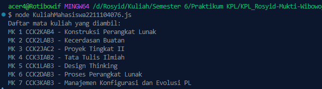

<h2>Nama : Rosyid Mukti Wibowo</h2>
<h2>NIM: 2211104076</h2>
<h2>Kelas : SE-06-03</h2>

<h3>TP Modul 7</h3>

### TP Data Mahasiswa
- Source Code DataMahasiswa_2211104076.js
```
const fs = require('fs');

class DataMahasiswa_2211104076 {
    constructor() {
        this.data = null;
    }

    ReadJSON() {
        try {
            // Membaca file JSON
            const rawData = fs.readFileSync('./tp7_1_2211104076.json');
            
            // Parsing data JSON menjadi object
            this.data = JSON.parse(rawData);
            
            // Menampilkan hasil deserialisasi dengan format yang diminta
            console.log(`Nama ${this.data.nama.depan} ${this.data.nama.belakang} dengan nim ${this.data.nim} dari fakultas ${this.data.fakultas}`);
            
            return this.data;
        } catch (error) {
            console.error("Terjadi kesalahan saat membaca file JSON:", error.message);
            return null;
        }
    }
}

// Contoh penggunaan
const dataMahasiswa = new DataMahasiswa_2211104076();
dataMahasiswa.ReadJSON();

module.exports = DataMahasiswa_2211104076;
```

- Source Code tp7_1_2211104076.json
```
{
    "nama": {
        "depan": "Rosyid",
        "belakang": "Wibowo"
    },
    "nim": 2211104076,
    "fakultas": "informatika"
}
```

- Berikut ini output code tersebut: <br>


- Kode DataMahasiswa_2211104076.js adalah sebuah modul Node.js yang digunakan untuk membaca dan menampilkan data mahasiswa dari file JSON tp7_1_2211104076.json. Kelas DataMahasiswa_2211104076 memiliki satu properti data dan satu metode ReadJSON(), yang berfungsi untuk membaca file JSON secara sinkron menggunakan modul fs (fs.readFileSync), kemudian mengubah isi file tersebut menjadi objek JavaScript dengan JSON.parse(). Setelah data berhasil di-deserialisasi, program akan mencetak informasi mahasiswa berupa nama lengkap, NIM, dan fakultas ke konsol dengan format yang telah ditentukan. Jika terjadi kesalahan saat membaca atau mem-parsing file, maka akan ditampilkan pesan error. File JSON berisi objek dengan struktur nama (depan dan belakang), NIM, dan fakultas mahasiswa.

### TP Kuliah Mahasiswa
- Source Code KuliahMahasiswa_2211104076.js
```
const fs = require('fs');

class KuliahMahasiswa2211104076 {
    constructor() {
        this.data = null;
    }

    ReadJSON() {
        try {
            // Membaca file JSON
            const rawData = fs.readFileSync('./tp7_2_2211104076.json');

            // Parsing JSON ke object
            this.data = JSON.parse(rawData);

            // Menampilkan hasil deserialisasi
            console.log("Daftar mata kuliah yang diambil:");
            this.data.courses.forEach((course, index) => {
                console.log(`MK ${index + 1} ${course.code} - ${course.name}`);
            });

            return this.data;
        } catch (error) {
            console.error("Terjadi kesalahan saat membaca file JSON:", error.message);
            return null;
        }
    }
}

// Contoh penggunaan
const kuliah = new KuliahMahasiswa2211104076();
kuliah.ReadJSON();

module.exports = KuliahMahasiswa2211104076;
```

- Source Code tp7_2_2211104076.json
```
{
    "nama": {
        "depan": "Rosyid",
        "belakang": "Wibowo"
    },
    "nim": 2211104076,
    "fakultas": "informatika"
}
```

- Berikut ini output code tersebut: <br>


- File KuliahMahasiswa_2211104076.js merupakan program Node.js yang berfungsi untuk membaca data mata kuliah dari file JSON tp7_2_2211104076.json dan menampilkannya ke konsol. Di dalam kelas KuliahMahasiswa2211104076, terdapat metode ReadJSON() yang menggunakan modul fs untuk membaca isi file secara sinkron, kemudian mengubahnya menjadi objek JavaScript dengan JSON.parse(). Data yang dibaca berisi daftar mata kuliah dalam bentuk array courses, di mana setiap elemen memiliki kode (code) dan nama mata kuliah (name). Program kemudian mencetak daftar mata kuliah tersebut ke konsol dengan format “MK x kode - nama”, di mana x adalah nomor urut. Jika terjadi kesalahan saat membaca atau memproses file JSON, maka akan ditampilkan pesan kesalahan di konsol.