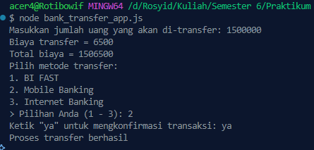

<h2>Nama : Rosyid Mukti Wibowo</h2>
<h2>NIM: 2211104076</h2>
<h2>Kelas : SE-06-03</h2>

<h3>Jurnal Modul 8</h3>

### Jurnal Transfer Bank
- Source Code transfer_bank_app.js
```
const fs = require('fs');
const readline = require('readline');

class BankTransferConfig {
  constructor(filename = 'bank_transfer_config.json') {
    this.filename = filename;
    this.defaultConfig = {
      lang: "en",
      transfer: {
        threshold: 25000000,
        low_fee: 6500,
        high_fee: 15000
      },
      methods: ["RTO (real-time)", "SKN", "RTGS", "BI FAST"],
      confirmation: {
        en: "yes",
        id: "ya"
      }
    };
    this.config = this.loadConfig();
  }

  loadConfig() {
    if (fs.existsSync(this.filename)) {
      const rawData = fs.readFileSync(this.filename);
      return JSON.parse(rawData);
    } else {
      fs.writeFileSync(this.filename, JSON.stringify(this.defaultConfig, null, 2));
      return { ...this.defaultConfig };
    }
  }

  getConfig() {
    return this.config;
  }

  saveConfig() {
    fs.writeFileSync(this.filename, JSON.stringify(this.config, null, 2));
  }

  setLang(lang) {
    this.config.lang = lang;
    this.saveConfig();
  }
}

// Program utama
const bankConfig = new BankTransferConfig();
const config = bankConfig.getConfig();

const rl = readline.createInterface({
  input: process.stdin,
  output: process.stdout
});

// Langkah 1: Minta input nominal transfer
const prompt1 = config.lang === 'id'
  ? "Masukkan jumlah uang yang akan di-transfer: "
  : "Please insert the amount of money to transfer: ";

rl.question(prompt1, (nominalStr) => {
  const nominal = parseInt(nominalStr);
  const isLow = nominal <= config.transfer.threshold;
  const fee = isLow ? config.transfer.low_fee : config.transfer.high_fee;
  const total = nominal + fee;

  if (config.lang === "id") {
    console.log(`Biaya transfer = ${fee}`);
    console.log(`Total biaya = ${total}`);
    console.log("Pilih metode transfer:");
  } else {
    console.log(`Transfer fee = ${fee}`);
    console.log(`Total amount = ${total}`);
    console.log("Select transfer method:");
  }

  // Langkah 2: Tampilkan metode transfer
  config.methods.forEach((method, index) => {
    console.log(`${index + 1}. ${method}`);
  });

  rl.question("> Pilihan Anda (1 - " + config.methods.length + "): ", (methodInput) => {
    const confirmPrompt = config.lang === 'id'
      ? `Ketik "${config.confirmation.id}" untuk mengkonfirmasi transaksi: `
      : `Please type "${config.confirmation.en}" to confirm the transaction: `;

    rl.question(confirmPrompt, (confirmationInput) => {
      const confirmed = (config.lang === 'id' && confirmationInput.toLowerCase() === config.confirmation.id.toLowerCase()) ||
                        (config.lang === 'en' && confirmationInput.toLowerCase() === config.confirmation.en.toLowerCase());

      if (confirmed) {
        console.log(config.lang === 'id' ? "Proses transfer berhasil" : "The transfer is completed");
      } else {
        console.log(config.lang === 'id' ? "Transfer dibatalkan" : "Transfer is cancelled");
      }

      rl.close();
    });
  });
});
```

- Source Code bank_transer_config.json
```
{
    "lang": "id",
    "transfer": {
      "threshold": 10000000,
      "low_fee": 6500,
      "high_fee": 15000
    },
    "methods": ["BI FAST", "Mobile Banking", "Internet Banking"],
    "confirmation": {
      "en": "yes",
      "id": "ya"
    }
  }
```

- Berikut ini output code tersebut: <br>


- File bank_transfer_app.js merupakan aplikasi Node.js yang menyimulasikan proses transfer uang menggunakan konfigurasi yang tersimpan dalam file bank_transfer_config.json. Program ini dimulai dengan memuat atau membuat konfigurasi default yang berisi pengaturan bahasa (id atau en), ambang batas nominal transfer untuk menentukan besar biaya (low/high fee), metode transfer yang tersedia, dan kata konfirmasi transaksi dalam dua bahasa. Aplikasi akan meminta input jumlah uang yang ingin ditransfer, menghitung dan menampilkan biaya serta total pembayaran berdasarkan ambang batas yang telah ditentukan. Setelah itu, pengguna diminta memilih metode transfer dan mengkonfirmasi transaksi dengan mengetik kata tertentu sesuai bahasa yang digunakan. Jika konfirmasi cocok, maka transfer dianggap berhasil, jika tidak, transfer dibatalkan. File konfigurasi dapat dimodifikasi dan disimpan ulang melalui class BankTransferConfig, membuat aplikasi ini fleksibel terhadap pengaturan yang berbeda.
