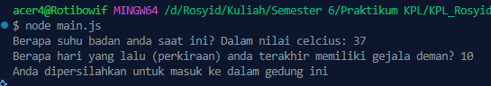

<h2>Nama : Rosyid Mukti Wibowo</h2>
<h2>NIM: 2211104076</h2>
<h2>Kelas : SE-06-03</h2>

<h3>TP Modul 8</h3>

### TP Covid Config
- Source Code main.js
```
const fs = require('fs');
const readline = require('readline');

// ==== CLASS DEFINITION ====
class CovidConfig {
  constructor(filename = 'covid_config.json') {
    this.filename = filename;
    this.defaultConfig = {
      satuan_suhu: 'celcius',
      batas_hari_deman: 14,
      pesan_ditolak: 'Anda tidak diperbolehkan masuk ke dalam gedung ini',
      pesan_diterima: 'Anda dipersilahkan untuk masuk ke dalam gedung ini',
    };
    this.config = this.loadConfig();
  }

  loadConfig() {
    if (fs.existsSync(this.filename)) {
      const rawData = fs.readFileSync(this.filename);
      return JSON.parse(rawData);
    } else {
      return { ...this.defaultConfig };
    }
  }

  saveConfig() {
    fs.writeFileSync(this.filename, JSON.stringify(this.config, null, 2));
  }

  ubahSatuan() {
    if (this.config.satuan_suhu === 'celcius') {
      this.config.satuan_suhu = 'fahrenheit';
    } else {
      this.config.satuan_suhu = 'celcius';
    }
    this.saveConfig();
  }

  getConfig() {
    return this.config;
  }
}

// ==== PROGRAM UTAMA ====
const covid = new CovidConfig();

// Ubah satuan suhu saat program dijalankan
covid.ubahSatuan();
const config = covid.getConfig();

const rl = readline.createInterface({
  input: process.stdin,
  output: process.stdout,
});

rl.question(`Berapa suhu badan anda saat ini? Dalam nilai ${config.satuan_suhu}: `, (suhu) => {
  rl.question('Berapa hari yang lalu (perkiraan) anda terakhir memiliki gejala deman? ', (hari) => {
    const suhuAngka = parseFloat(suhu);
    const hariAngka = parseInt(hari);

    let suhuValid = false;
    if (config.satuan_suhu === 'celcius') {
      suhuValid = suhuAngka >= 36.5 && suhuAngka <= 37.5;
    } else if (config.satuan_suhu === 'fahrenheit') {
      suhuValid = suhuAngka >= 97.7 && suhuAngka <= 99.5;
    }

    const hariValid = hariAngka < config.batas_hari_deman;

    if (suhuValid && hariValid) {
      console.log(config.pesan_diterima);
    } else {
      console.log(config.pesan_ditolak);
    }

    rl.close();
  });
});
```

- Source Code covid_config.json
```
{
  "satuan_suhu": "celcius",
  "batas_hari_deman": 14,
  "pesan_ditolak": "Anda tidak diperbolehkan masuk ke dalam gedung ini",
  "pesan_diterima": "Anda dipersilahkan untuk masuk ke dalam gedung ini"
}
```

- Berikut ini output code tersebut: <br>


- File main.js sebenarnya merupakan program Node.js untuk simulasi skrining kesehatan terkait COVID-19, bukan untuk entri glosarium, dan menggunakan konfigurasi dari file covid_config.json. Program ini mendefinisikan kelas CovidConfig yang bertugas memuat, menyimpan, dan memodifikasi konfigurasi, seperti satuan suhu (celcius atau fahrenheit), batas hari demam, serta pesan diterima dan ditolak. Saat dijalankan, program memuat konfigurasi, mengubah satuan suhu (meskipun fungsi ubahSatuan() saat ini selalu mengatur ke 'celcius' tanpa perubahan nyata), lalu meminta input suhu tubuh dan lama gejala demam dari pengguna melalui terminal. Berdasarkan input tersebut dan konfigurasi yang dimuat, program menentukan apakah pengguna boleh masuk ke gedung (dengan suhu normal dan tidak demam dalam batas hari yang ditentukan) atau tidak, lalu menampilkan pesan yang sesuai. File JSON covid_config.json menyediakan nilai konfigurasi awal yang dapat diubah dan disimpan kembali oleh program.
