<h2>Nama : Rosyid Mukti Wibowo</h2>
<h2>NIM: 2211104076</h2>
<h2>Kelas : SE-06-03</h2>

<h3>Jurnal Modul 9</h3>

### Jurnal 9_1 API Film
- Source Code 
```
# Install library (jalankan hanya jika belum diinstall)
!pip install fastapi uvicorn nest-asyncio pyngrok

# Import library
from fastapi import FastAPI
from pydantic import BaseModel
from typing import List
import nest_asyncio
from pyngrok import ngrok, conf
import uvicorn

# Inisialisasi FastAPI
app = FastAPI()

# Konfigurasi ngrok (ganti dengan auth_token milikmu)
conf.get_default().auth_token = "2wD8EQAgrSKi44uM2vcvMzE5tmt_6ynuyCXxfQDm9iBgoH1ua"

# MODEL
class Movie(BaseModel):
    Title: str
    Director: str
    Stars: List[str]
    Description: str

# DATA DEFAULT (Top 3 IMDb per Mei 2025)
movie_list = [
    {
        "Title": "The Shawshank Redemption",
        "Director": "Frank Darabont",
        "Stars": ["Tim Robbins", "Morgan Freeman", "Bob Gunton"],
        "Description": "Two imprisoned men bond over a number of years, finding solace and eventual redemption through acts of common decency."
    },
    {
        "Title": "The Godfather",
        "Director": "Francis Ford Coppola",
        "Stars": ["Marlon Brando", "Al Pacino", "James Caan"],
        "Description": "The aging patriarch of an organized crime dynasty transfers control of his clandestine empire to his reluctant son."
    },
    {
        "Title": "The Dark Knight",
        "Director": "Christopher Nolan",
        "Stars": ["Christian Bale", "Heath Ledger", "Aaron Eckhart"],
        "Description": "When the menace known as the Joker wreaks havoc and chaos on the people of Gotham, Batman must accept one of the greatest psychological and physical tests."
    },
]

# ENDPOINTS
@app.get("/api/Movies")
def get_all_movies():
    return movie_list

@app.get("/api/Movies/{id}")
def get_movie_by_id(id: int):
    if 0 <= id < len(movie_list):
        return movie_list[id]
    return {"error": "Movie tidak ditemukan"}

@app.post("/api/Movies")
def add_movie(movie: Movie):
    movie_list.append(movie.dict())
    return {"pesan": "Movie berhasil ditambahkan"}

@app.delete("/api/Movies/{id}")
def delete_movie(id: int):
    if 0 <= id < len(movie_list):
        deleted = movie_list.pop(id)
        return {"pesan": "Movie berhasil dihapus", "data": deleted}
    return {"error": "Movie tidak ditemukan"}

# Jalankan server
nest_asyncio.apply()
public_url = ngrok.connect(8000)
print("🎬 Swagger UI:", public_url.public_url + "/docs")
print("🎬 API URL:", public_url.public_url)

uvicorn.run(app, port=8000)
```

- Berikut ini output code tersebut: <br>
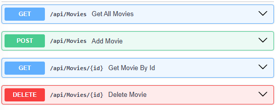
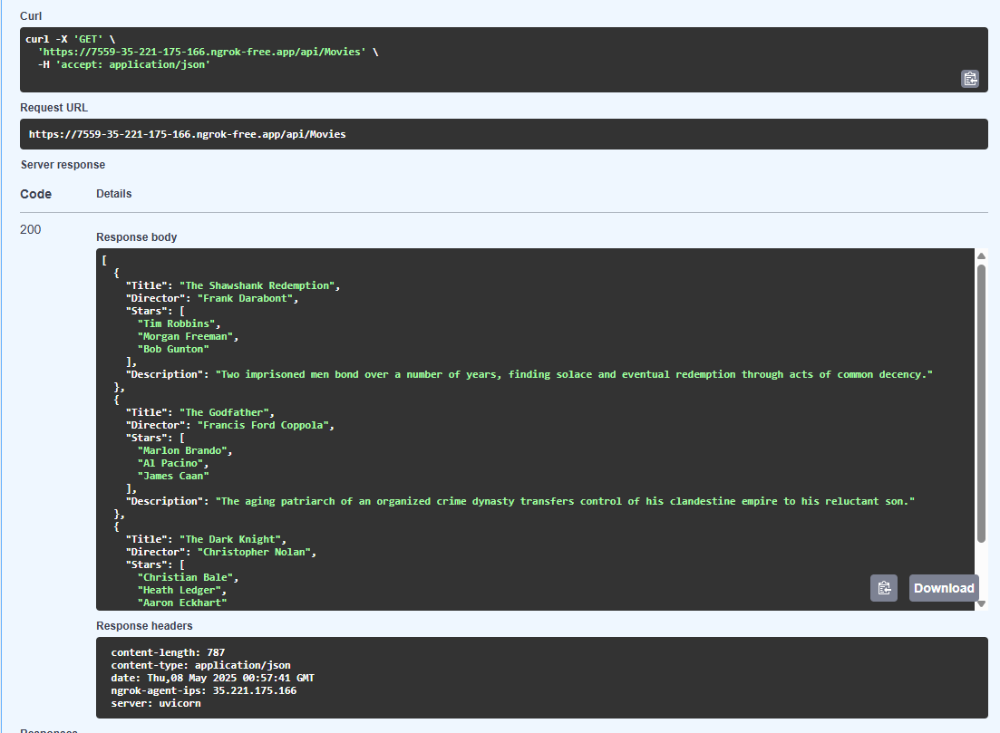
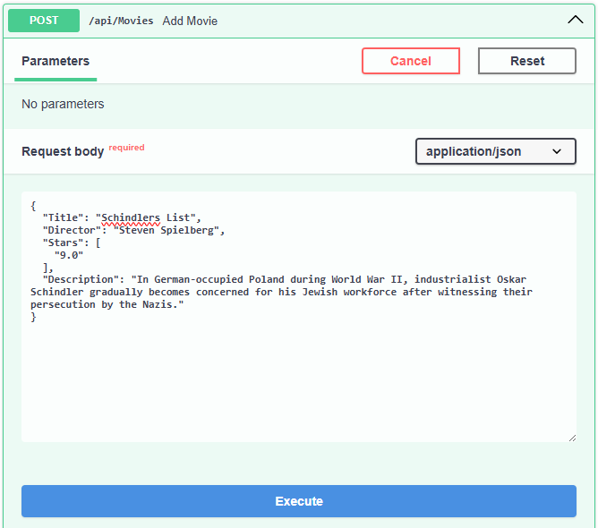
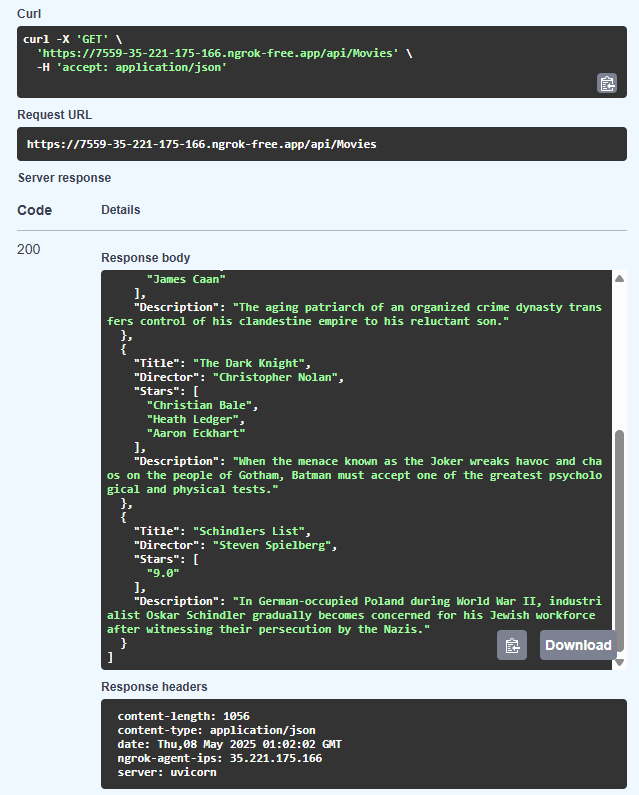
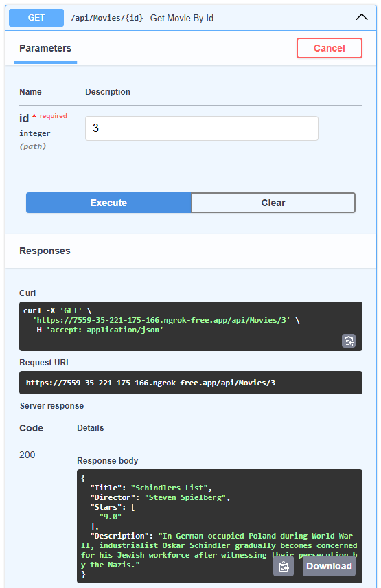
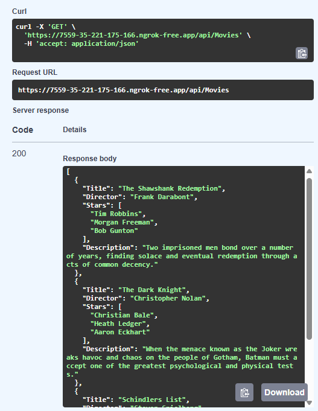

- Kode ini membangun API manajemen film menggunakan FastAPI yang menyediakan operasi CRUD (Create, Read, Update, Delete) dengan data awal tiga film teratas IMDb per Mei 2025 (fiktif), dijalankan secara lokal tetapi dapat diakses publik melalui tunneling ngrok. Setelah menginstal dependensi dan mengkonfigurasi token autentikasi ngrok, aplikasi mendefinisikan model Pydantic Movie untuk validasi data dan menyimpan daftar film dalam movie_list, menyediakan empat endpoint: GET semua film, GET film berdasarkan indeks ID, POST menambah film baru, dan DELETE menghapus film sesuai indeks. Server dihosting menggunakan Uvicorn dengan bantuan nest_asyncio untuk kompatibilitas asinkron, sementara ngrok membuka tunnel ke port 8000 yang menghasilkan URL publik beserta dokumentasi Swagger UI otomatis di /docs untuk testing API, memungkinkan akses eksternal dan interaksi dengan data film melalui internet.

<br>

### Jurnal 9_3 API Mahasiswa
- Source Code 
```
# Jalankan hanya jika di Colab atau belum install
!pip install fastapi uvicorn nest-asyncio pyngrok

# Import library
from fastapi import FastAPI
from pydantic import BaseModel
from typing import List
import nest_asyncio
from pyngrok import ngrok, conf
import uvicorn

# Inisialisasi FastAPI
app = FastAPI()

# Konfigurasi ngrok (ganti dengan token kamu jika perlu)
conf.get_default().auth_token = "2wD8EQAgrSKi44uM2vcvMzE5tmt_6ynuyCXxfQDm9iBgoH1ua"

# MODEL
class Mahasiswa(BaseModel):
    Name: str
    Nim: str
    Course: List[str]
    Year: int

# DATA DEFAULT (Anggota kelompok TUBES)
mahasiswa_list = [
    {
        "Name": "Afif Ramadhani",
        "Nim": "2211104066",
        "Course": ["Pemrograman", "Kalkulus", "Basis Data"],
        "Year": 2022
    },
    {
        "Name": "Kholil Abdi Prasetyo",
        "Nim": "2211104071",
        "Course": ["Pemrograman", "Matematika Diskrit", "Pancasila"],
        "Year": 2022
    },
    {
        "Name": "Adhitya Sofwan Al Rasyid",
        "Nim": "2211104089",
        "Course": ["Pemrograman", "UI/UX", "Bahasa Inggris"],
        "Year": 2022
    }
]

# ENDPOINTS
@app.get("/api/Mahasiswa")
def get_all_mahasiswa():
    return mahasiswa_list

@app.get("/api/Mahasiswa/{id}")
def get_mahasiswa_by_id(id: int):
    if 0 <= id < len(mahasiswa_list):
        return mahasiswa_list[id]
    return {"error": "Mahasiswa tidak ditemukan"}

@app.post("/api/Mahasiswa")
def add_mahasiswa(mahasiswa: Mahasiswa):
    mahasiswa_list.append(mahasiswa.dict())
    return {"pesan": "Mahasiswa berhasil ditambahkan"}

@app.delete("/api/Mahasiswa/{id}")
def delete_mahasiswa(id: int):
    if 0 <= id < len(mahasiswa_list):
        deleted = mahasiswa_list.pop(id)
        return {"pesan": "Mahasiswa berhasil dihapus", "data": deleted}
    return {"error": "Mahasiswa tidak ditemukan"}

# Jalankan server dengan ngrok
nest_asyncio.apply()
public_url = ngrok.connect(8000)
print("🎓 Swagger UI:", public_url.public_url + "/docs")
print("🎓 API URL:", public_url.public_url)

uvicorn.run(app, port=8000)

```

- Berikut ini output code tersebut: <br>
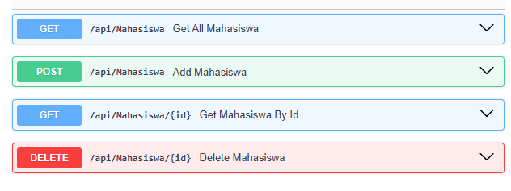
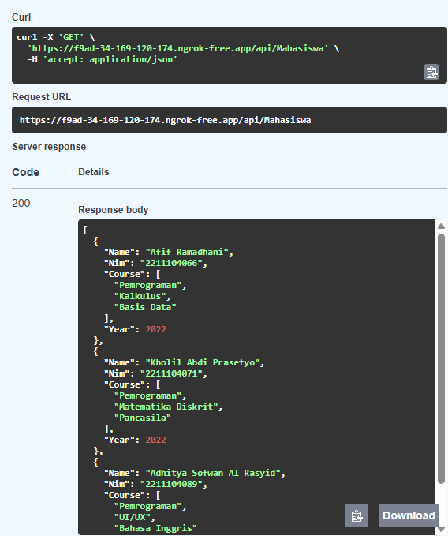
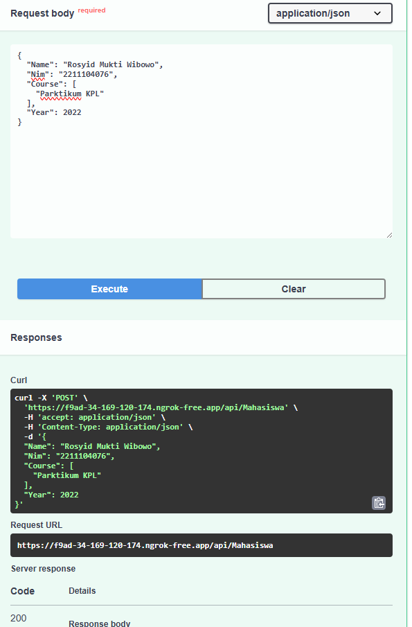
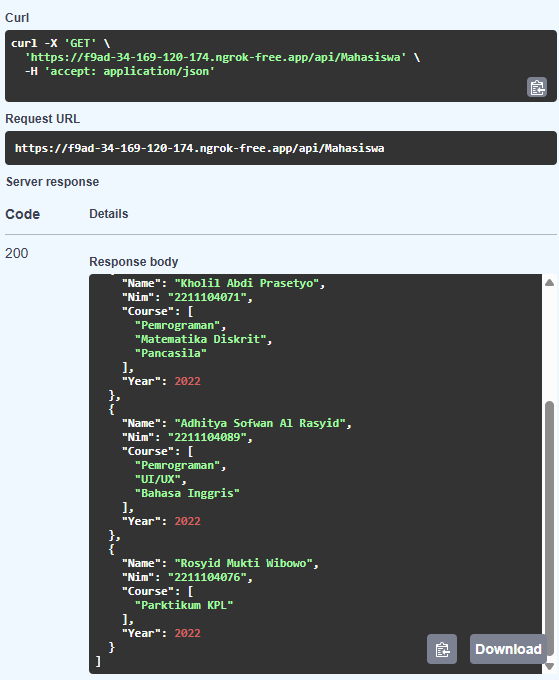
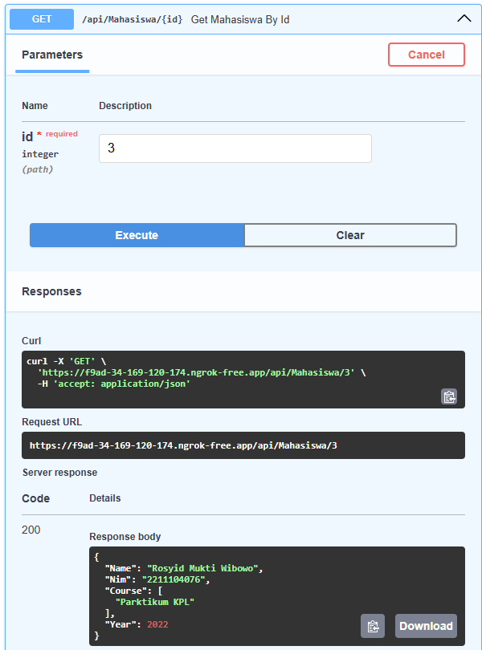
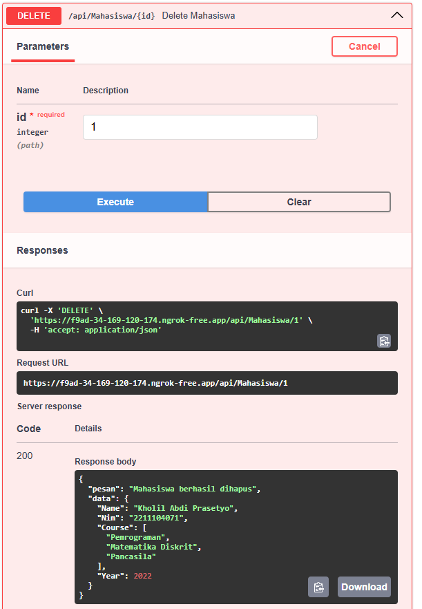

- Kode ini membuat API manajemen data mahasiswa menggunakan FastAPI yang menyediakan operasi CRUD (Create, Read, Update, Delete) dengan data awal anggota kelompok TUBES, dijalankan secara lokal namun dapat diakses publik melalui tunneling ngrok. Setelah menginstal dependensi dan mengkonfigurasi token ngrok, aplikasi mendefinisikan model Pydantic Mahasiswa untuk validasi data yang mencakup nama, NIM, mata kuliah (list), dan tahun masuk, lalu menyimpan data dalam mahasiswa_list berisi tiga entri default. Terdapat empat endpoint: GET semua data, GET by indeks ID, POST untuk menambah data, dan DELETE untuk menghapus data berdasarkan indeks. Server dihosting menggunakan Uvicorn dengan nest_asyncio untuk kompatibilitas lingkungan async, sementara ngrok membuka tunnel ke port 8000 yang menghasilkan URL publik beserta dokumentasi Swagger UI otomatis di /docs, memungkinkan pengujian dan interaksi eksternal dengan API melalui internet untuk mengelola data akademik mahasiswa.
