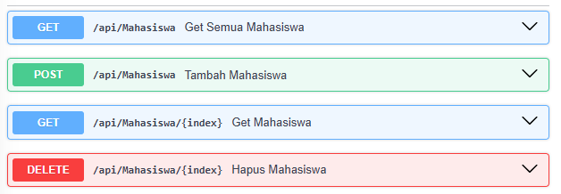
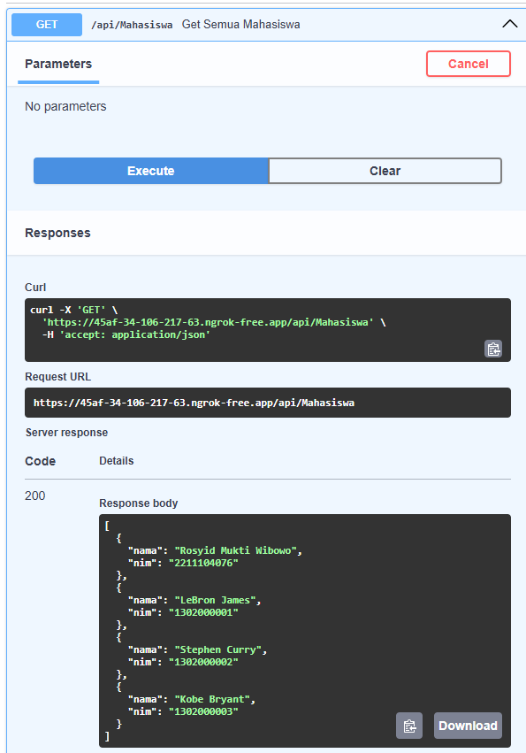
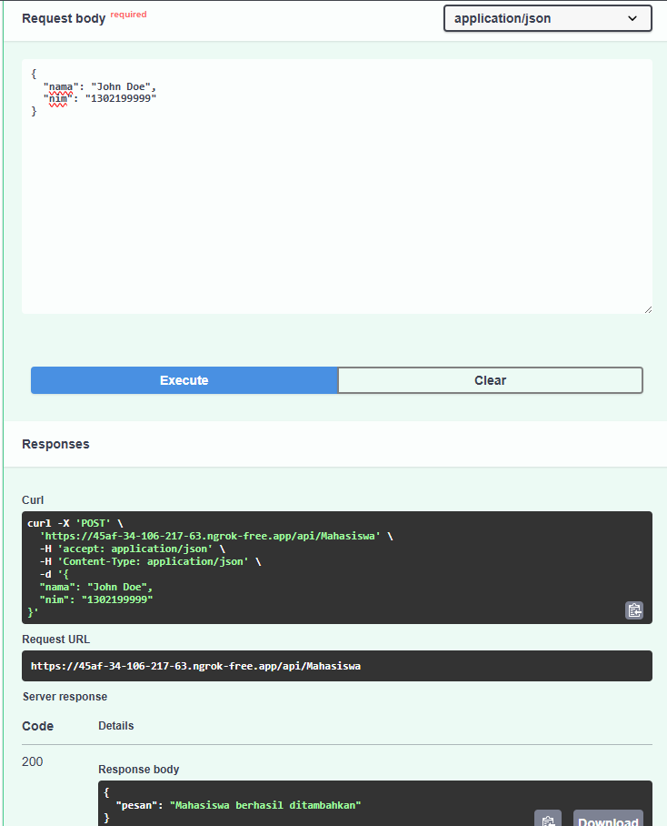
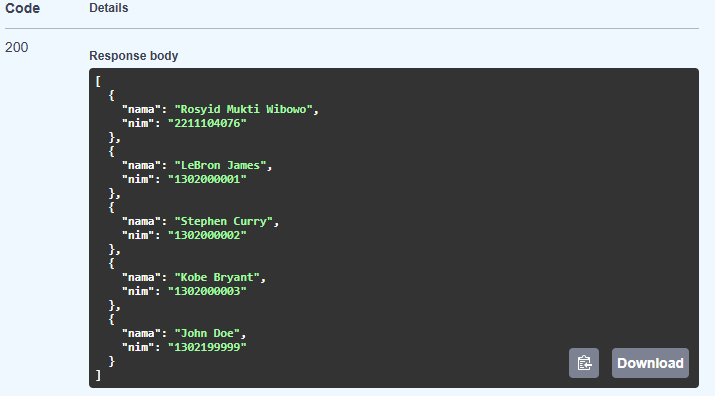

<h2>Nama : Rosyid Mukti Wibowo</h2>
<h2>NIM: 2211104076</h2>
<h2>Kelas : SE-06-03</h2>

<h3>TP Modul 9</h3>

### TP Data Mahasiswa
- Source Code TP_9.ipynb
```
# Install library (jalankan hanya jika belum diinstall)
!pip install fastapi uvicorn nest-asyncio pyngrok

# Import library
from fastapi import FastAPI
from pydantic import BaseModel
import nest_asyncio
from pyngrok import ngrok, conf
import uvicorn

# Inisialisasi FastAPI
app = FastAPI()

# Konfigurasi ngrok (ganti token dengan punyamu)
conf.get_default().auth_token = "2wD8EQAgrSKi44uM2vcvMzE5tmt_6ynuyCXxfQDm9iBgoH1ua"

# MODELS
class Mahasiswa(BaseModel):
    nama: str
    nim: str

# DATA MAHASISWA - isi sesuai anggota kelompok (nama kamu paling atas)
mahasiswa_list = [
    {"nama": "Rosyid Mukti Wibowo", "nim": "1234567890"},
    {"nama": "LeBron James", "nim": "1302000001"},
    {"nama": "Stephen Curry", "nim": "1302000002"},
    {"nama": "Kobe Bryant", "nim": "1302000003"},
]

# ENDPOINTS
@app.get("/api/mahasiswa")
def get_semua_mahasiswa():
    return mahasiswa_list

@app.get("/api/mahasiswa/{index}")
def get_mahasiswa(index: int):
    if 0 <= index < len(mahasiswa_list):
        return mahasiswa_list[index]
    return {"error": "Index tidak ditemukan"}

@app.post("/api/mahasiswa")
def tambah_mahasiswa(mahasiswa: Mahasiswa):
    mahasiswa_list.append(mahasiswa.dict())
    return {"pesan": "Mahasiswa berhasil ditambahkan"}

@app.delete("/api/mahasiswa/{index}")
def hapus_mahasiswa(index: int):
    if 0 <= index < len(mahasiswa_list):
        deleted = mahasiswa_list.pop(index)
        return {"pesan": "Mahasiswa berhasil dihapus", "data": deleted}
    return {"error": "Index tidak ditemukan"}

# Jalankan server
nest_asyncio.apply()
public_url = ngrok.connect(8000)
print("🚀 Swagger UI:", public_url.public_url + "/docs")
print("🚀 API URL:", public_url.public_url)

uvicorn.run(app, port=8000)

```


- Berikut ini output code tersebut: <br>





- Kode tersebut merupakan implementasi API sederhana menggunakan FastAPI untuk mengelola data mahasiswa dengan fitur CRUD (Create, Read, Update, Delete) yang dijalankan secara lokal namun dapat diakses publik melalui tunneling ngrok. Aplikasi ini dimulai dengan menginstal dependensi yang diperlukan, lalu membuat instance FastAPI dan mengkonfigurasi autentikasi ngrok menggunakan token pengguna untuk membuat tunnel ke server lokal pada port 8000. Data mahasiswa disimpan dalam list mahasiswa_list dengan struktur Pydantic Model Mahasiswa sebagai validasi input, menyediakan empat endpoint: GET semua data, GET by index, POST untuk menambah data, dan DELETE untuk menghapus data. Server dijalankan dengan Uvicorn dan dibungkus menggunakan nest_asyncio untuk kompatibilitas lingkungan async, sementara ngrok menghasilkan URL publik yang memungkinkan akses eksternal ke API melalui internet beserta dokumentasi Swagger UI otomatis di endpoint /docs.