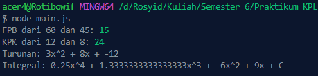

<h2>Nama : Rosyid Mukti Wibowo</h2>
<h2>NIM: 2211104076</h2>
<h2>Kelas : SE-06-03</h2>

<h3>Jurnal Modul 9</h3>

### Jurnal 10
- Source Code matematikaLibraries.js
```
const MatematikaLibraries = {
  FPB: function(a, b) {
    while (b !== 0) {
      let temp = b;
      b = a % b;
      a = temp;
    }
    return Math.abs(a);
  },

  KPK: function(a, b) {
    return Math.abs(a * b) / this.FPB(a, b);
  },

  Turunan: function(coefficients) {
    const result = [];

    for (let i = 0; i < coefficients.length - 1; i++) {
      const pangkat = coefficients.length - 1 - i;
      const turunan = coefficients[i] * pangkat;
      if (turunan === 0) continue;

      let term = `${turunan}`;
      if (pangkat - 1 === 1) term += 'x';
      else if (pangkat - 1 > 1) term += `x^${pangkat - 1}`;
      result.push(term);
    }

    return result.join(' + ');
  },

  Integral: function(coefficients) {
    const result = [];

    for (let i = 0; i < coefficients.length; i++) {
      const pangkat = coefficients.length - i;
      const integral = coefficients[i] / pangkat;
      let term = `${integral}`;
      if (pangkat === 1) term += 'x';
      else term += `x^${pangkat}`;
      result.push(term);
    }

    result.push('C');
    return result.join(' + ');
  }
};

module.exports = MatematikaLibraries;
```

- Source Code main.js
```
const MathLib = require('./matematikaLibraries');

console.log("FPB dari 60 dan 45:", MathLib.FPB(60, 45));         
console.log("KPK dari 12 dan 8:", MathLib.KPK(12, 8));           

const koefTurunan = [1, 4, -12, 9]; 
console.log("Turunan:", MathLib.Turunan(koefTurunan));           

const koefIntegral = [1, 4, -12, 9]; 
console.log("Integral:", MathLib.Integral(koefIntegral));                    
```

- Berikut ini output code tersebut: <br>


- File matematikaLibraries.js merupakan library yang berisi kumpulan fungsi matematika dasar yang dapat digunakan untuk berbagai operasi numerik. Di dalamnya terdapat fungsi untuk menghitung Faktor Persekutuan Terbesar (FPB), Kelipatan Persekutuan Terkecil (KPK), turunan dari persamaan polinomial, serta integral dari persamaan polinomial. Setiap fungsi dirancang agar mudah dipanggil dan menghasilkan output yang sesuai dengan contoh yang diberikan pada soal. File main.js bertindak sebagai program utama yang memanfaatkan dan menguji fungsi-fungsi dari library matematikaLibraries.js. File ini menampilkan pemanggilan fungsi FPB, KPK, turunan, dan integral dengan input contoh, lalu mencetak hasil perhitungannya ke konsol. File ini menunjukkan bahwa semua fungsi di dalam library berjalan dengan baik dan memberikan output sesuai harapan.