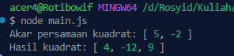

<h2>Nama : Rosyid Mukti Wibowo</h2>
<h2>NIM: 2211104076</h2>
<h2>Kelas : SE-06-03</h2>

<h3>TP Modul 10</h3>

### TP Data Mahasiswa
- Source Code aljabarLibraries.js
```
const AljabarLibraries = {
  AkarPersamaanKuadrat: function([a, b, c]) {
    const D = b * b - 4 * a * c;
    if (D < 0) {
      return "Tidak memiliki akar real";
    }

    const x1 = (-b + Math.sqrt(D)) / (2 * a);
    const x2 = (-b - Math.sqrt(D)) / (2 * a);
    return [x1, x2];
  },

  HasilKuadrat: function([a, b]) {
    const a2 = a * a;
    const b2 = b * b;
    const ab2 = 2 * a * b;
    return [a2, ab2, b2]; 
  }
};

module.exports = AljabarLibraries;
```

- Source Code main.js
```
const Aljabar = require('./aljabarLibraries');

const akar = Aljabar.AkarPersamaanKuadrat([1, -3, -10]);  
console.log("Akar persamaan kuadrat:", akar);            

const hasilKuadrat = Aljabar.HasilKuadrat([2, -3]);       
console.log("Hasil kuadrat:", hasilKuadrat);              
```

- Berikut ini output code tersebut: <br>


- File aljabarLibraries.js berfungsi sebagai library atau modul yang berisi dua fungsi utama untuk melakukan perhitungan aljabar. Fungsi AkarPersamaanKuadrat menghitung akar-akar dari persamaan kuadrat menggunakan rumus kuadrat umum, dan akan mengembalikan dua akar jika diskriminannya bernilai positif. Fungsi HasilKuadrat menghitung hasil dari bentuk kuadrat (a + b)² dan mengembalikan tiga komponen yaitu a², 2ab, dan b². File main.js bertindak sebagai program utama (console application project) yang mengimpor dan menggunakan fungsi-fungsi dari library aljabarLibraries.js. File ini menampilkan contoh penggunaan dari kedua fungsi, yaitu menghitung akar dari persamaan kuadrat dan hasil kuadrat dari dua bilangan, lalu mencetak hasilnya ke konsol. File ini menjadi bukti bahwa library yang dibuat dapat berjalan dengan baik saat diintegrasikan.