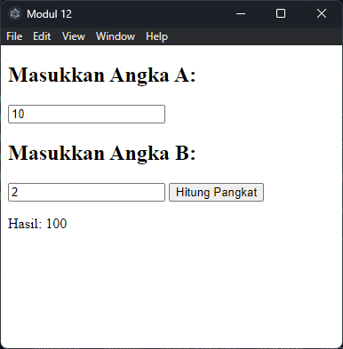
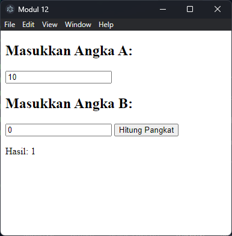

<h2>Nama : Rosyid Mukti Wibowo</h2>
<h2>NIM: 2211104076</h2>
<h2>Kelas : SE-06-03</h2>

<h3>TP Modul 12</h3>

### Jurnal 12
- Source Code main.js
```
const { app, BrowserWindow } = require('electron');
const path = require('path');

function createWindow() {
  const win = new BrowserWindow({
    width: 400,
    height: 400,
    webPreferences: {
      preload: path.join(__dirname, 'renderer.js'),
      nodeIntegration: true,
      contextIsolation: false
    }
  });

  win.loadFile('index.html');
}

app.whenReady().then(createWindow);
```

- Source Code renderer.js
```
const { CariNilaiPangkat } = require('./logic');

window.proses = function () {
  const a = parseInt(document.getElementById("angkaA").value);
  const b = parseInt(document.getElementById("angkaB").value);
  const hasil = CariNilaiPangkat(a, b);
  document.getElementById("output").innerText = `Hasil: ${hasil}`;
};             
```

- Source Code logic.js
```
function CariNilaiPangkat(a, b) {
  if (b === 0) return 1;
  if (b < 0) return -1;
  if (b > 10 || a > 100) return -2;

  let result = 1;
  for (let i = 0; i < b; i++) {
    result *= a;

    // Cek overflow untuk 32-bit signed int
    if (result > 2147483647) return -3;
  }

  return result;
}

module.exports = { CariNilaiPangkat };           
```

- Source Code index.html
```
<!DOCTYPE html>
<html>
<head>
  <meta charset="UTF-8">
  <title>Modul 12</title>
</head>
<body>
  <h2>Masukkan Angka A:</h2>
  <input type="number" id="angkaA" />
  <h2>Masukkan Angka B:</h2>
  <input type="number" id="angkaB" />
  <button onclick="proses()">Hitung Pangkat</button>
  <p id="output">Hasil: </p>

  <script src="renderer.js"></script>
</body>
</html>             
```
- Source Code package.json
```
{
  "name": "modul12_2211104076",
  "version": "1.0.0",
  "main": "main.js",
  "scripts": {
    "start": "electron .",
    "test": "node test/test.js"
  },
  "devDependencies": {
    "electron": "^29.0.0"
  }
}        
```

- Source Code test.js
```
const assert = require('assert');
const { CariNilaiPangkat } = require('../logic');

// Branch coverage: semua kondisi
try {
  assert.strictEqual(CariNilaiPangkat(2, 3), 8);
  assert.strictEqual(CariNilaiPangkat(5, 0), 1);
  assert.strictEqual(CariNilaiPangkat(4, -2), -1);
  assert.strictEqual(CariNilaiPangkat(101, 2), -2);
  assert.strictEqual(CariNilaiPangkat(2, 11), -2);
  assert.strictEqual(CariNilaiPangkat(9, 30), -3);

  console.log("✅ Semua unit test berhasil.");
} catch (error) {
  console.error("❌ Test gagal:", error.message);
}        
```

- Berikut ini output code tersebut: <br>



- Fungsi CariNilaiPangkat merupakan fungsi logika yang digunakan untuk menghitung nilai pangkat dari dua buah bilangan bulat dengan aturan khusus, seperti mengembalikan 1 jika pangkat bernilai nol, -1 jika pangkat negatif, -2 jika input melebihi batas yang ditentukan, dan -3 jika hasil perhitungan melebihi batas maksimum bilangan integer 32-bit. Fungsi ini diimplementasikan menggunakan iterasi tanpa bantuan pustaka bawaan, dan dipisahkan ke dalam file logic.js agar bisa digunakan baik di aplikasi GUI berbasis Electron maupun dalam pengujian unit test dengan Node.js. Pemisahan ini penting karena kode GUI mengandung elemen seperti window, yang tidak dikenali di lingkungan Node.js. Dengan pemisahan logika tersebut, fungsi dapat diuji secara menyeluruh melalui berbagai skenario pengujian untuk memastikan seluruh percabangan logika berfungsi dengan benar, dan pada saat yang sama tetap dapat diintegrasikan dengan tampilan antarmuka pengguna.