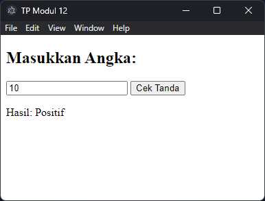

<h2>Nama : Rosyid Mukti Wibowo</h2>
<h2>NIM: 2211104076</h2>
<h2>Kelas : SE-06-03</h2>

<h3>TP Modul 12</h3>

### TP 12
- Source Code main.js
```
const { app, BrowserWindow } = require('electron');
const path = require('path');

function createWindow() {
  const win = new BrowserWindow({
    width: 400,
    height: 300,
    webPreferences: {
      preload: path.join(__dirname, 'renderer.js'),
      nodeIntegration: true,
      contextIsolation: false
    }
  });

  win.loadFile('index.html');
}

app.whenReady().then(() => {
  createWindow();
});
```

- Source Code renderer.js
```
function cariTandaBilangan(a) {
  if (a < 0) return "Negatif";
  else if (a > 0) return "Positif";
  else return "Nol";
}

window.cekTanda = function() {
  const input = parseInt(document.getElementById("inputNumber").value);
  const hasil = cariTandaBilangan(input);
  document.getElementById("hasilOutput").innerText = `Hasil: ${hasil}`;
};

module.exports = { cariTandaBilangan }; // Agar bisa diakses di unit test             
```
- Source Code index.html
```
function cariTandaBilangan(a) {
  if (a < 0) return "Negatif";
  else if (a > 0) return "Positif";
  else return "Nol";
}

window.cekTanda = function() {
  const input = parseInt(document.getElementById("inputNumber").value);
  const hasil = cariTandaBilangan(input);
  document.getElementById("hasilOutput").innerText = `Hasil: ${hasil}`;
};

module.exports = { cariTandaBilangan }; // Agar bisa diakses di unit test             
```
- Source Code package.json
```
{
  "name": "tpmodul12_2211104076",
  "version": "1.0.0",
  "main": "main.js",
  "scripts": {
    "start": "electron .",
    "test": "node test/test.js"
  },
  "devDependencies": {
    "electron": "^29.0.0"
  }
}          
```
- Source Code test.js
```
const assert = require('assert');
const { cariTandaBilangan } = require('../renderer');

try {
  assert.strictEqual(cariTandaBilangan(-5), "Negatif");
  assert.strictEqual(cariTandaBilangan(10), "Positif");
  assert.strictEqual(cariTandaBilangan(0), "Nol");

  console.log("✅ Semua unit test berhasil.");
} catch (e) {
  console.error("❌ Test gagal:", e.message);
}         
```

- Berikut ini output code tersebut: <br>



- Tugas Pendahuluan Modul 12 ini merupakan implementasi aplikasi GUI sederhana menggunakan JavaScript dan framework Electron, yang berfungsi untuk menentukan tanda suatu bilangan (positif, negatif, atau nol) berdasarkan input pengguna. Aplikasi ini terdiri dari tiga komponen utama, yaitu index.html sebagai tampilan antarmuka, renderer.js sebagai pengolah logika dan interaksi pengguna, serta main.js sebagai entry point untuk menjalankan jendela aplikasi. Fungsi utama bernama cariTandaBilangan memproses input angka dan memberikan output sesuai kondisi nilainya, yang kemudian ditampilkan pada GUI ketika tombol ditekan. Selain itu, dilakukan juga unit testing menggunakan Node.js untuk memastikan fungsi bekerja sesuai harapan, dengan hasil pengujian menunjukkan seluruh skenario telah berhasil diuji. Proyek ini juga mencakup pengamatan penggunaan CPU dan memori selama aplikasi berjalan untuk kebutuhan profiling, menjadikannya contoh lengkap integrasi GUI, logika program, pengujian, dan observasi performa dalam pengembangan perangkat lunak.