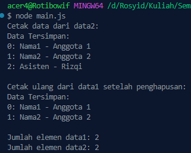

<h2>Nama : Rosyid Mukti Wibowo</h2>
<h2>NIM: 2211104076</h2>
<h2>Kelas : SE-06-03</h2>

<h3>Jurnal Modul 13</h3>

### Jurnal Modul 13
- Source Code main.js
```
const PusatDataSingleton = require('./PusatDataSingleton');

// A. Buat dua variabel data1 dan data2
const data1 = PusatDataSingleton.getDataSingleton();
const data2 = PusatDataSingleton.getDataSingleton();

// B. Tambah data ke data1
data1.addSebuahData("Nama1 - Anggota 1");
data1.addSebuahData("Nama2 - Anggota 2");
data1.addSebuahData("Asisten - Rizki");

// C. Cetak isi data2
console.log("Cetak data dari data2:");
data2.printSemuaData();

// D. Hapus data asisten pada data2
data2.hapusSebuahData(2); // index ke-2 asisten

// E. Cetak ulang isi data dari data1
console.log("\nCetak ulang dari data1 setelah penghapusan:");
data1.printSemuaData();

// F. Cetak jumlah data dari keduanya
console.log(`\nJumlah elemen data1: ${data1.getSemuaData().length}`);
console.log(`Jumlah elemen data2: ${data2.getSemuaData().length}`);
```

- Source Code PusatDataSingleton.js
```
class PusatDataSingleton {
  constructor() {
    if (PusatDataSingleton._instance) {
      throw new Error("Gunakan getDataSingleton() untuk mendapatkan instance.");
    }
    this.DataTersimpan = [];
    PusatDataSingleton._instance = this;
  }

  static getDataSingleton() {
    if (!PusatDataSingleton._instance) {
      new PusatDataSingleton();
    }
    return PusatDataSingleton._instance;
  }

  getSemuaData() {
    return this.DataTersimpan;
  }

  printSemuaData() {
    console.log("Data Tersimpan:");
    this.DataTersimpan.forEach((item, index) => {
      console.log(`${index}: ${item}`);
    });
  }

  addSebuahData(input) {
    this.DataTersimpan.push(input);
  }

  hapusSebuahData(index) {
    if (index >= 0 && index < this.DataTersimpan.length) {
      this.DataTersimpan.splice(index, 1);
    } else {
      console.log("Index tidak valid");
    }
  }
}

module.exports = PusatDataSingleton;
```

- Berikut ini output code tersebut: <br>


- Program di atas menerapkan Singleton Design Pattern dalam JavaScript melalui kelas PusatDataSingleton, yang memastikan hanya satu instance dari kelas ini dapat dibuat dan digunakan di seluruh program. Kelas ini menyimpan data dalam sebuah list (DataTersimpan) dan menyediakan berbagai method seperti addSebuahData() untuk menambahkan data, hapusSebuahData() untuk menghapus data berdasarkan indeks, printSemuaData() untuk menampilkan semua data, serta getSemuaData() untuk mengambil seluruh isi list. Pada fungsi utama, dua variabel (data1 dan data2) diisi menggunakan getDataSingleton(), yang sebenarnya mengakses instance yang sama, sehingga perubahan data melalui data1 akan langsung terlihat saat diakses melalui data2, membuktikan bahwa hanya ada satu instance yang digunakan bersama (singleton).