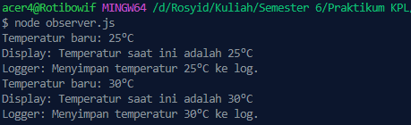

<h2>Nama : Rosyid Mukti Wibowo</h2>
<h2>NIM: 2211104076</h2>
<h2>Kelas : SE-06-03</h2>

<h3>TP Modul 13</h3>

### TP Modul 13
- Source Code observer.js
```
// Subject
class WeatherStation {
  constructor() {
    this.temperature = 0;
    this.observers = [];
  }

  subscribe(observer) {
    this.observers.push(observer);
  }

  unsubscribe(observer) {
    this.observers = this.observers.filter(obs => obs !== observer);
  }

  notify() {
    this.observers.forEach(observer => observer.update(this.temperature));
  }

  setTemperature(temp) {
    console.log(`Temperatur baru: ${temp}°C`);
    this.temperature = temp;
    this.notify();
  }
}

// Observer
class TemperatureDisplay {
  update(temp) {
    console.log(`Display: Temperatur saat ini adalah ${temp}°C`);
  }
}

class TemperatureLogger {
  update(temp) {
    console.log(`Logger: Menyimpan temperatur ${temp}°C ke log.`);
  }
}

// Main
const weatherStation = new WeatherStation();

const display = new TemperatureDisplay();
const logger = new TemperatureLogger();

weatherStation.subscribe(display);
weatherStation.subscribe(logger);

weatherStation.setTemperature(25);
weatherStation.setTemperature(30);
```

- Berikut ini output code tersebut: <br>


- Kode di atas mengimplementasikan Observer Design Pattern dalam JavaScript, di mana kelas WeatherStation bertindak sebagai Subject yang menyimpan data temperatur dan daftar Observer-nya. Setiap kali temperatur berubah melalui metode setTemperature(), metode notify() akan dipanggil untuk memberi tahu semua observer tentang perubahan tersebut. Dua observer yang di-subscribe, yaitu TemperatureDisplay dan TemperatureLogger, masing-masing akan menampilkan dan mencatat temperatur terbaru. Pola ini memungkinkan komunikasi satu-ke-banyak secara otomatis antara objek tanpa perlu saling ketergantungan secara langsung, sehingga membuat sistem lebih modular dan mudah dikembangkan.
