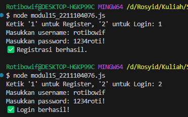

<h2>Nama : Rosyid Mukti Wibowo</h2>
<h2>NIM: 2211104076</h2>
<h2>Kelas : SE-06-03</h2>

<h3>Jurnal Modul 15</h3>

### Jurnal
- Source Code modul15_2211104076.js
```
const fs = require("fs");
const readline = require("readline");
const crypto = require("crypto");

// Fungsi hashing password
function hashPassword(password) {
  return crypto.createHash("sha256").update(password).digest("hex");
}

// Validasi input
function isValidUsername(username) {
  const regex = /^[A-Za-z]+$/;
  return username.length >= 4 && username.length <= 20 && regex.test(username);
}

function isValidPassword(password, username) {
  const regexSpecial = /[!@#$%^&*]/;
  return (
    password.length >= 8 &&
    password.length <= 20 &&
    regexSpecial.test(password) &&
    !password.toLowerCase().includes(username.toLowerCase())
  );
}

const rl = readline.createInterface({
  input: process.stdin,
  output: process.stdout
});

function register() {
  rl.question("Masukkan username: ", (username) => {
    if (!isValidUsername(username)) {
      console.log("❌ Username tidak valid. Harus 4-20 huruf alfabet ASCII.");
      return rl.close();
    }

    rl.question("Masukkan password: ", (password) => {
      if (!isValidPassword(password, username)) {
        console.log("❌ Password tidak valid. Panjang 8-20 karakter, mengandung karakter unik, dan tidak boleh mengandung username.");
        return rl.close();
      }

      const hashed = hashPassword(password);
      const user = { username, password: hashed };

      let users = [];
      if (fs.existsSync("users.json")) {
        users = JSON.parse(fs.readFileSync("users.json"));
      }

      // Cek apakah user sudah terdaftar
      if (users.find(u => u.username === username)) {
        console.log("❌ Username sudah terdaftar.");
        return rl.close();
      }

      users.push(user);
      fs.writeFileSync("users.json", JSON.stringify(users, null, 2));
      console.log("✅ Registrasi berhasil.");
      rl.close();
    });
  });
}

function login() {
  rl.question("Masukkan username: ", (username) => {
    rl.question("Masukkan password: ", (password) => {
      const hashed = hashPassword(password);
      if (!fs.existsSync("users.json")) {
        console.log("❌ Tidak ada user terdaftar.");
        return rl.close();
      }

      const users = JSON.parse(fs.readFileSync("users.json"));
      const user = users.find(u => u.username === username && u.password === hashed);
      if (user) {
        console.log("✅ Login berhasil!");
      } else {
        console.log("❌ Username atau password salah.");
      }
      rl.close();
    });
  });
}

rl.question("Ketik '1' untuk Register, '2' untuk Login: ", (choice) => {
  if (choice === "1") {
    register();
  } else if (choice === "2") {
    login();
  } else {
    console.log("Pilihan tidak valid.");
    rl.close();
  }
});
```

- Source Code users.json
```
[
  {
    "username": "rotibowif",
    "password": "cc413e5d402ba6f89db098f54928ec0b00ec2ca8a3d342d9b57fadbba09a4c51"
  }
]
```

- Berikut ini output code tersebut: <br>


- Kode tersebut adalah aplikasi desktop sederhana berbasis Node.js yang memungkinkan pengguna melakukan **registrasi** dan **login** dengan menerapkan prinsip *secure coding*. Saat registrasi, program meminta username dan password, kemudian melakukan **validasi input** seperti panjang karakter, hanya huruf untuk username, serta password yang harus memiliki karakter spesial dan tidak boleh mengandung username. Password kemudian di-*hash* menggunakan algoritma **SHA-256** agar tidak disimpan dalam bentuk asli, lalu disimpan bersama username ke dalam file `users.json`. Saat login, input password kembali di-*hash* dan dibandingkan dengan data di file JSON. Program juga menangani berbagai kesalahan input dengan memberikan pesan yang jelas agar tidak terjadi error saat runtime.